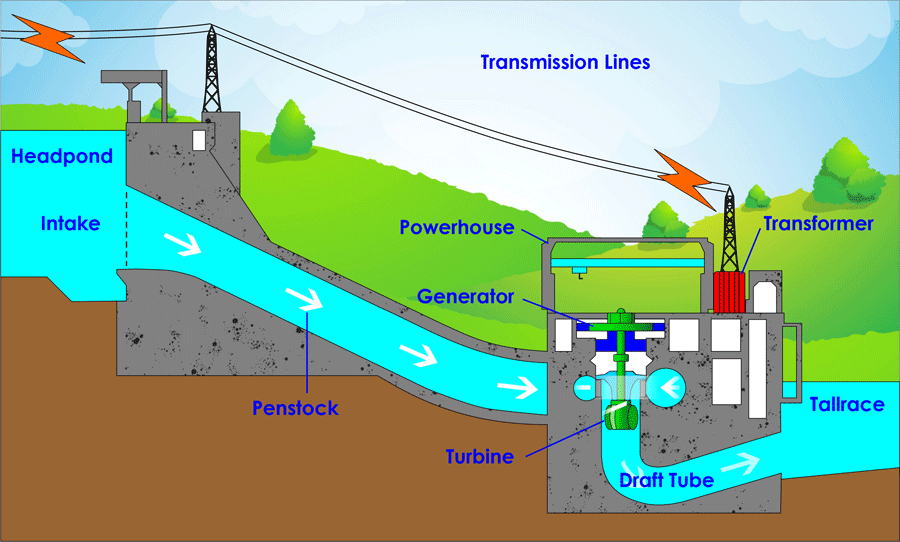

# Water And Electricity!

#### Declarative vs imperative

    int musicName = "upTownFunk";
    var thread = new Thread( () -> {
        var bytes = downloadMusic(musicName);
        playMusic(bytes)
    });
    thread.start();
    thread.join();

-------------------------

    Mono.just(musicName)
        .flarMap(name -> downloadMusic(name))
        .doOnNext(music -> playMusic(music))
        .subscribe()

### flatMap

    Mono<Double> = Mono.just(54)
        .flatMap(number -> Mono.just(someIOReturningString(number))
        .flatMap(string -> functionReturningMonoDouble(string))

flatMap turns the current flow/stream into another flow/stream.
Imagine mapping a Mono into another Mono: you will have Mono<Mono<X>>.
Which is not desirable. Instead we flatten the flow into Mono<X> using flatMap.

### doOnNext

    Mono<X> xMono = ........
        .doOnNext(x-> sendNotificationFor(x))

to do something asynchronously off the main execution flow, use doOnNext.
Operations defined in doOnNext won't affect the main flow.

